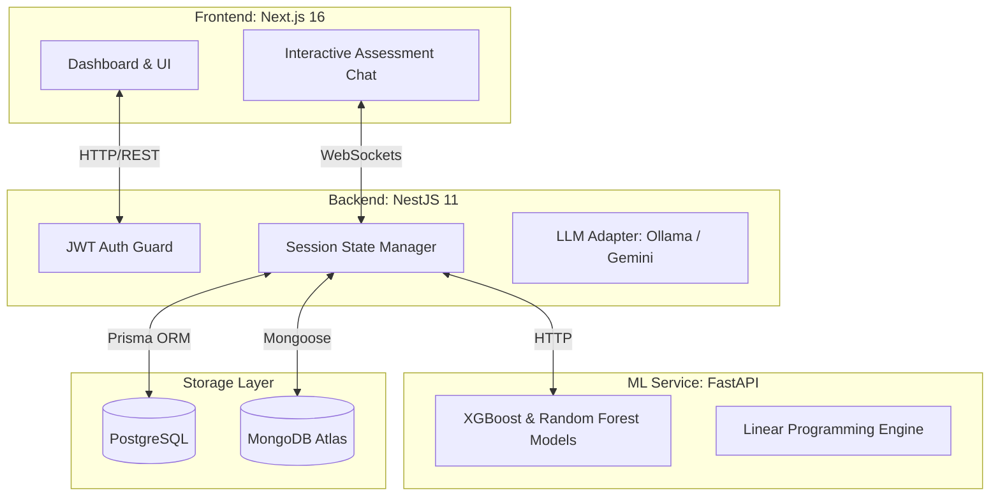

<div align="center">
  
  
  # StratosAI
  
  **The Automated AI Strategy & Assessment Engine for Modern Enterprises**
  
  [](https://opensource.org/licenses/MIT)
  [](https://nextjs.org/)
  [](https://nestjs.com/)
  [](https://fastapi.tiangolo.com/)

  [View Live Demo](https://stratos-ai-two.vercel.app/) · [Report Bug](https://github.com/your-org/stratosai/issues) · [Request Feature](https://github.com/your-org/stratosai/issues)
</div>

---

## Overview

**StratosAI** acts as an AI-driven corporate strategy consultant. By guiding enterprises through an interactive, phase-based chatbot assessment, it evaluates AI readiness and infrastructure. Under the hood, a suite of custom machine learning models forecasts ROI, predicts initiative success probabilities, evaluates multidimensional risk exposure, and optimizes budget allocations.

The final deliverable is a board-ready, interactive dashboard and strategic roadmap tailored specifically to the organization's maturity and industry constraints.

## Key Features

### Adaptive Chatbot Assessment
A dynamic 14-question conversation tree divided into 5 critical phases:
- **Phase 1: Profile** (Industry, Revenue, Headcount)
- **Phase 2: Goals** (Objectives, Barriers, Operational Expectations)
- **Phase 3: Maturity** (Infrastructure, Data Readiness, Governance)
- **Phase 4: Budget** (Total CapEx, Revenue Allocation, ROI Targets)
- **Phase 5: Constraints** (Regulatory, Talent, Market Pressure)

> **Dynamic Branching**: The assessment engine adapts in real-time. For instance, budgets under $50K bypass custom ML infrastructure tracks in favor of SaaS integrations, while regulated industries trigger strict compliance checkpoints.

### Predictive Machine Learning Engine
Powered by a FastAPI backend, StratosAI utilizes five specialized models trained on corporate AI adoption data spanning two decades:
1. **ROI Forecaster**: *XGBoost Regressor* projecting 12- and 36-month ROI.
2. **Success Predictor**: *XGBoost Classifier + SMOTE* analyzing the viability of initiatives.
3. **Risk Radar**: *Random Forest Multi-Output* scoring Technical, Financial, Talent, Regulatory, and Market risks.
4. **Maturity Assessor**: *K-Means Clustering* mapping organizations against peer benchmarks.
5. **Budget Optimizer**: *Knapsack LP + XGBoost* recommending mathematically optimal capital deployment.

## System Architecture

StratosAI is architected as a highly modular, decoupled platform.



## Technology Stack

| Domain | Technologies Used |
| :--- | :--- |
| **Frontend** | Next.js (16), React (19), Tailwind CSS (v4), Zustand, Recharts |
| **Backend Gateway** | NestJS (11), Prisma, Socket.io, Passport JWT |
| **Machine Learning** | FastAPI, Python 3, XGBoost, Scikit-Learn, PuLP |
| **LLM Orchestration** | Local Ollama (Llama 3.2), Google Gemini 1.5 Flash API |
| **Relational Database** | PostgreSQL (User Auth, Benchmark Data, Initiative Metadata) |
| **Document Database** | MongoDB (Chat Transcripts, Generated Reports) |

## Getting Started

### Prerequisites
- [Docker & Docker Compose](https://www.docker.com/) (Recommended)
- Node.js v20+ & npm
- Python 3.10+ (for manual ML service setup)

### Option 1: Quick Start with Docker (Recommended)

The entire platform can be spun up using our orchestrated Docker environment:

```bash
# 1. Clone the repository (adjust URL as needed)
git clone https://github.com/your-org/stratosai.git
cd stratosai

# 2. Configure environment variables (setup backend/.env)
# For example: cp backend/.env.example backend/.env

# 3. Build and launch all services
docker-compose up --build
```

*Services will be available at:*
- **Frontend Dashboard:** `http://localhost:3000`
- **NestJS Gateway:** `http://localhost:8080` (Internal: `3001`)
- **FastAPI ML Service:** `http://localhost:5001`

### Option 2: Manual Development Setup

<details>
<summary>Click to expand manual setup instructions</summary>

**1. Install Global Workspace Dependencies**
```bash
npm install
```

**2. Setup Backend (NestJS)**
```bash
cd backend
# Ensure .env is populated with DATABASE_URL, MONGODB_URI, JWT_SECRET, etc.
npx prisma generate
npm run start:dev
```

**3. Setup Frontend (Next.js)**
```bash
cd frontend
# Ensure .env.local contains NEXT_PUBLIC_API_URL
npm run dev
```

**4. Setup ML Service (FastAPI)**
```bash
cd ml
python3 -m venv venv
source venv/bin/activate
pip install -r requirements.txt
uvicorn app:app --host 0.0.0.0 --port 5001 --reload
```
</details>

## Documentation & References

Explore our detailed architectural documents to understand the internal mechanics of StratosAI:

- [Master Plan & Objectives](file:///Users/shourya/Progarms/StratosAI/MASTER_PLAN.md)
- [Detailed Architecture](file:///Users/shourya/Progarms/StratosAI/ARCHITECTURE.md)
- [API Endpoints Reference](file:///Users/shourya/Progarms/StratosAI/API_ENDPOINTS.md)
- [PostgreSQL Database Schema](file:///Users/shourya/Progarms/StratosAI/backend/prisma/schema.prisma)

## Contributing

We welcome contributions to StratosAI! Please read our `CONTRIBUTING.md` for details on our code of conduct and the process for submitting pull requests.

## License

This project is licensed under the MIT License.
